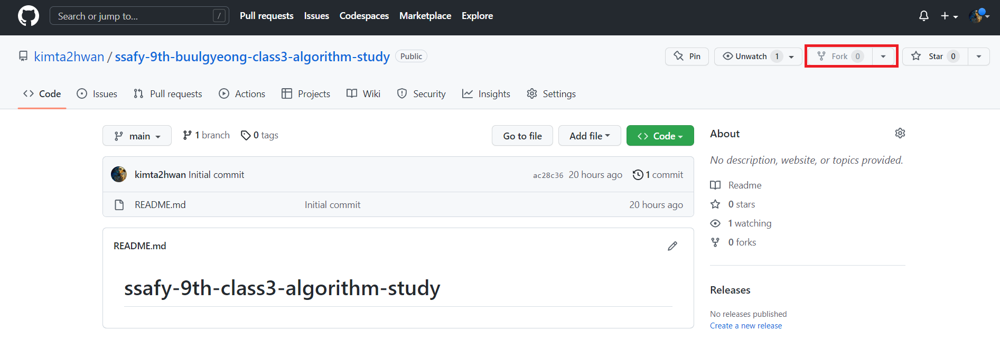
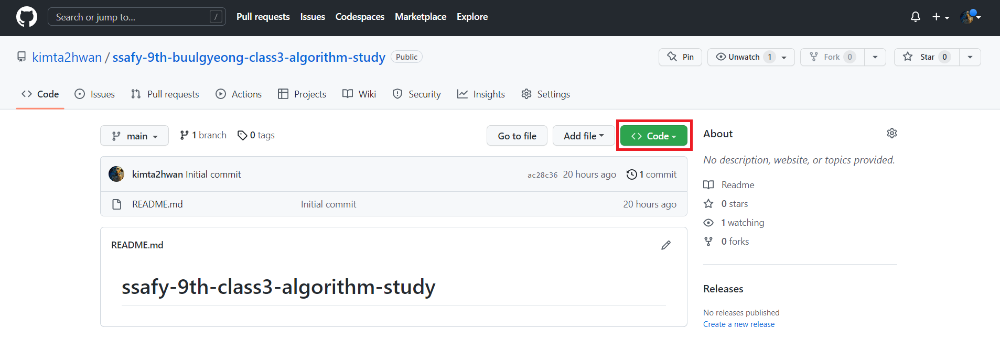
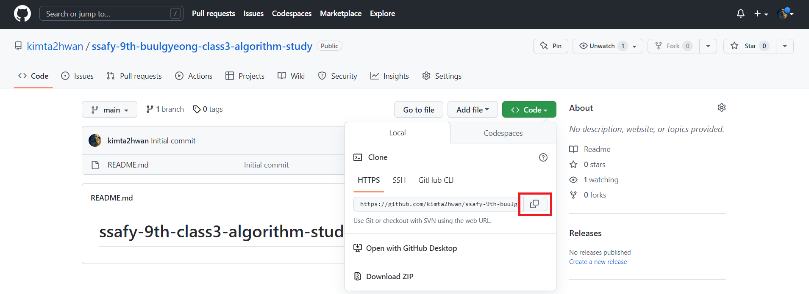
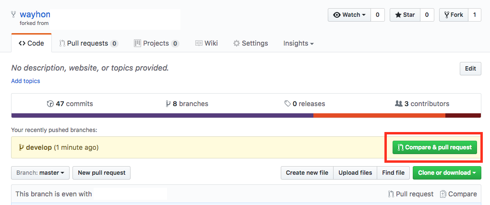
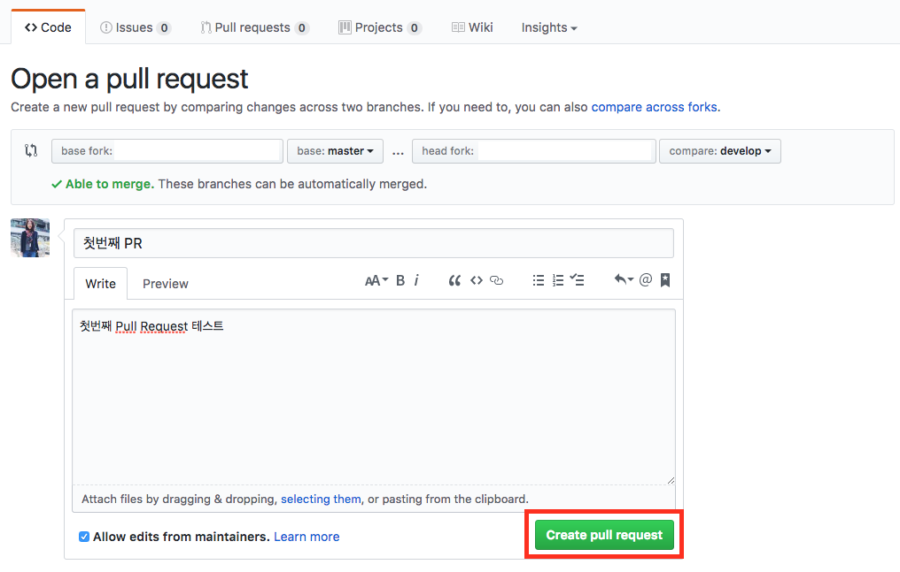

# ⭐ **SSAFY 9기 부울경 3반 알고리즘 스터디** ⭐

## ✔️ **진행 가이드**
---
### **1. fork 하기**

+ 현재 저장소를 fork 버튼을 눌러 자신의 자신의 저장소로 fork 한다.



+ fork가 완료되면 자신의 계정에 새로운 저장소가 생긴다.

&nbsp;

### **2. clone 하기**

+ fork로 생성한 자신의 계정 저장소에서 code 버튼을 누르고 표시되는 url을 복사 한다.




+ fork 한 저장소를 clone 할 폴더에서 터미널을 실행한다.


+ 명령어를 입력하여 fork 한 저장소를 로컬에 clone 한다.

```
$ git clone https://github.com/[USERNAME]/[REPOSITORY_NAME].git
[예시] $ https://github.com/kimta2hwan/ssafy-9th-buulgyeong-class3-algorithm-study.git
```

&nbsp;

### **3. remote 설정**

+ 로컬 저장소에 원격 저장소를 추가한다.

```
# 원본 프로젝트 저장소를 원격 저장소로 추가
$ git remote add upstream https://github.com/kimta2hwan/ssafy-9th-buulgyeong-class3-algorithm-study.git

# 원격 저장소 설정 현황 확인방법
$ git remote -v
```

&nbsp;

### **4. 알고리즘을 푼다.**

&nbsp;

### **5. add**

```
$ git add <파일/디렉토리 경로>
[예시] $ git add week01/P1000.java
```

&nbsp;

### **6. commit**

```
$ git commit -m "(이름): (문제 번호) (문제 제목)"
[예시] $ git commit -m "홍길동: 1000 A+B"
```

&nbsp;

### **7. push**

```
$ git push origin main
```
```
$ git push upstream main
```

&nbsp;

### **8. compare & pull request**

+ push 완료 후 본인 계정의 github 저장소에 들어오면 Compare & pull reqeust 버튼이 활성화되어 있다.



+ 해당 버튼을 선택하여 메시지를 작성하고 PR을 생성한다.



&nbsp;

### **9. 동기화**

+ 원본 저장소에 Merge가 완료되면 로컬 코드와 원본 저장소의 코드를 동기화 한다.
+ 나중에 추가로 작업할 일이 있으면 git pull upstream 명령을 통해 원본 저장소와 동기화를 진행하고 4~8을 반복한다.

```
# 코드 동기화
$ git pull upstream
```

&nbsp;

&nbsp;

## 📁 **폴더 관리**
---
> 주차 시작 전 해당 폴더가 생성됩니다.  
> 해당 폴더 안에 자신의 이름으로 폴더를 생성한 후 파일을 넣습니다.

```
[예시]
week01
   ㄴ 홍길동
      - P1000.java
      - P2000.java

   ㄴ 이길동
      - P1000.java
      - P2000.java
```

&nbsp;

&nbsp;

## 📝 **커밋 컨벤션**
---
> 커밋 시 해당 커밋 컨벤션을 지켜주세요.  
> 한 문제 단위로 커밋 부탁드립니다.

```
$ git commit -m "(이름): (문제 번호) (문제 제목)"
[예시] $ git commit -m "홍길동: 1000 A+B"
```

&nbsp;

&nbsp;

<!--
## 📅 **일정표**
---
-->